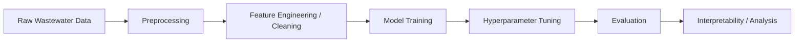

<div align="center">

# The Application of Machine Learning in Wastewater Treatment

### Interpretable, reproducible machine learning workflows for wastewater-treatment analysis

[](https://www.python.org/)
[](#)
[](#results)
[](#results)
[](#)

</div>

---

## Overview

This project explores how machine learning can support **wastewater-treatment analysis** through:

- microbiome-informed prediction,
- reusable tabular ML pipelines,
- model benchmarking across classical and ensemble methods,
- and interpretable outputs that are more useful for scientific research.

Instead of keeping everything inside ad hoc notebooks, this repository organizes the workflow into a reusable Python package for **preprocessing**, **training**, **tuning**, **evaluation**, and **analysis**.

## Why this project matters

Wastewater treatment is a complex biological and operational system. Subtle changes in microbial composition, chemical conditions, or treatment parameters can affect performance in ways that are difficult to model manually.

Machine learning helps by:

- identifying nonlinear relationships in tabular biological data,
- improving predictive performance over simple baselines,
- standardizing experimentation across many model families,
- and supporting interpretable analysis to guide scientific understanding.

## Key highlights

- Built a **modular Python codebase** under `src/` rather than relying only on notebooks.
- Benchmarked **15+ regression models** in a unified workflow.
- Achieved strongest reported performance with **CatBoost**, followed closely by **Extra Trees**, **XGBoost**, and **LightGBM**.
- Designed the repo to support both **research experimentation** and **cleaner reproducibility**.

## Repository structure

```text
.
├── data/                       # datasets used in experiments
├── notebooks/                  # research notebooks and experiment iterations
├── src/
│   └── wastewater_ml/
│       ├── config/             # configuration helpers
│       ├── evaluation/         # scoring and analysis utilities
│       ├── models/             # model definitions / wrappers
│       ├── pipelines/          # end-to-end ML workflows
│       ├── preprocessing/      # tabular preprocessing logic
│       └── tuning/             # hyperparameter search utilities
├── Change rate(Class).ipynb
└── README.md
```

## Workflow at a glance



## Models benchmarked

This repository currently benchmarks a broad range of regression models, including:

- Linear Regression
- SGD Regressor
- Elastic Net
- Bayesian Ridge
- Support Vector Regressor
- K-Neighbors Regressor
- Decision Tree Regressor
- Random Forest Regressor
- Gradient Boosting Regressor
- AdaBoost Regressor
- Bagging Regressor
- Extra Trees Regressor
- LightGBM Regressor
- XGBoost Regressor
- CatBoost Regressor

## Results

### Top reported models

| Rank | Model | Reported R² | MAE | RMSE |
|---|---|---:|---:|---:|
| 1 | CatBoost Regressor | 95.0509 | 0.005713 | 0.011042 |
| 2 | Extra Trees Regressor | 91.9467 | 0.004255 | 0.014095 |
| 3 | XGBoost Regressor | 91.6460 | 0.006372 | 0.014356 |
| 4 | LightGBM Regressor | 88.7129 | 0.008086 | 0.016687 |
| 5 | Gradient Boosting Regressor | 86.0720 | 0.010640 | 0.018536 |

### Benchmark takeaway

The strongest models were **tree-based ensemble methods**, which substantially outperformed simpler linear baselines. This suggests the wastewater target relationships are likely **nonlinear**, making ensemble approaches better suited for the problem.

> Note: the current notebook output appears to report R² on a percentage-like scale. For final public presentation, it is cleaner to convert this to the standard form, for example `R² = 0.9505` instead of `95.0505`, if that matches your implementation.

## What this repo demonstrates

This project is valuable beyond just model accuracy. It shows:

- the ability to turn research experimentation into **structured code**,
- experience comparing many models under a shared evaluation pipeline,
- comfort working on a **domain-specific scientific ML problem**,
- and attention to both **predictive performance** and **interpretability**.

## Quick start

### 1) Clone the repository

```bash
git clone git@github.com:DavidQifongJiang/The-Application-of-Machine-Learning-in-Wastewater-Treatment.git
cd The-Application-of-Machine-Learning-in-Wastewater-Treatment
```

### 2) Create a virtual environment

```bash
python -m venv .venv
source .venv/bin/activate
# On Windows PowerShell: .venv\Scripts\activate
```

### 3) Install dependencies

```bash
pip install -r requirements.txt
```

If `requirements.txt` is not included yet, install the packages used in your notebooks and export them before sharing the final version of the repo.

### 4) Run the notebooks

```bash
jupyter notebook
```

## Suggested figures to add

To make this repository more visually compelling, add an `assets/` folder and include:

- a **model comparison bar chart**,
- a **feature importance or SHAP plot**,
- and a **prediction vs. actual** or **residual** plot.

Example placeholders:

```md


```

## Future improvements

- Add a clean `requirements.txt` or `environment.yml`
- Add one canonical notebook such as `final_results.ipynb`
- Add a short dataset description and target definition
- Rename any regression metric labels that currently use classification terms like `accuracy`
- Expand the interpretability section with domain findings
- Add a license for a more complete open-source presentation

## Resume-ready summary

Built a reusable machine learning pipeline for wastewater-treatment research, structuring preprocessing, model training, hyperparameter tuning, and evaluation into a modular Python codebase and benchmarking 15+ regression models on microbiome-related tabular data.

## Acknowledgments

This repository reflects research-oriented work in applied machine learning for environmental and biological data analysis.

---

## Contact

If you'd like to discuss the project, methodology, or potential collaboration, feel free to connect through GitHub or LinkedIn.
