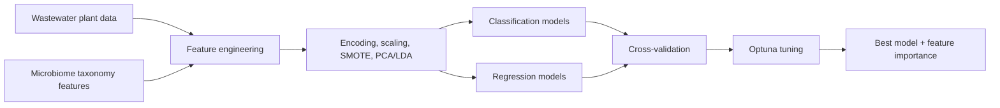

<div align="center">

# The Application of Machine Learning in Wastewater Treatment

### Interpretable, reusable machine-learning workflows for wastewater-treatment analysis

[](https://www.python.org/)
[](#supported-models)
[](#results)
[](#)

</div>

---

## Overview

This project explores how machine learning can support wastewater-treatment analysis through microbiome-informed prediction, reusable tabular ML pipelines, model benchmarking, hyperparameter tuning, and interpretable outputs.

The original work started as exploratory scientific notebooks. The current repository reorganizes the reusable pieces into a Python package for preprocessing, training, tuning, evaluation, and analysis.

## Why This Project Matters

Wastewater treatment is a complex biological and operational system. Subtle changes in microbial composition, chemical conditions, and treatment parameters can affect performance in ways that are difficult to model manually.

Machine learning helps by:

- identifying nonlinear relationships in tabular biological data
- standardizing experiments across many model families
- improving predictive performance over simple baselines
- supporting feature-importance and SHAP-style interpretability

## Key Highlights

- Reorganized research notebooks into a modular `src/` Python package.
- Supports classification and regression workflows for wastewater and microbiome-derived features.
- Benchmarks classical ML, tree ensembles, boosted trees, and neural baselines.
- Includes Optuna-based hyperparameter tuning and K-fold validation helpers.
- Preserves original data and notebooks for research provenance.
- Adds package metadata, smoke tests, documentation, and a quickstart example.

## Repository Layout

```text
.
├── data/                 # Original and derived wastewater datasets
├── docs/                 # Architecture, data notes, and model card
├── examples/             # Minimal package usage examples
├── figures/              # Generated figures and plots
├── notebooks/            # Original exploratory research notebooks
├── src/wastewater_ml/    # Reusable Python package
└── tests/                # Lightweight smoke tests
```

## Workflow



## Supported Models

Classification includes logistic regression, SGD, perceptron, passive aggressive, ridge classifier, SVM, KNN, decision tree, Naive Bayes, random forest, gradient boosting, AdaBoost, bagging, extra trees, LightGBM, CatBoost, XGBoost, and MLP.

Regression includes linear regression, SGD regressor, kernel ridge, elastic net, Bayesian ridge, SVR, KNN regressor, decision tree, random forest, gradient boosting, AdaBoost, bagging, extra trees, LightGBM, XGBoost, CatBoost, and MLP.

## Results

### Top Reported Regression Models

| Rank | Model | Reported R2 | MAE | RMSE |
|---|---|---:|---:|---:|
| 1 | CatBoost Regressor | 95.0509 | 0.005713 | 0.011042 |
| 2 | Extra Trees Regressor | 91.9467 | 0.004255 | 0.014095 |
| 3 | XGBoost Regressor | 91.6460 | 0.006372 | 0.014356 |
| 4 | LightGBM Regressor | 88.7129 | 0.008086 | 0.016687 |
| 5 | Gradient Boosting Regressor | 86.0720 | 0.010640 | 0.018536 |

The strongest reported models were tree-based ensembles, which suggests the wastewater target relationships are nonlinear and better captured by boosted or bagged tree methods than by simple linear baselines.

> Note: the notebook output reports R2 on a percentage-like scale. Before using these numbers in a paper or resume, convert them to a standard format if needed, for example `R2 = 0.9505` instead of `95.0509`.

## Quick Start

```bash
python -m venv .venv
.venv\Scripts\activate
pip install -e ".[dev]"
pytest
```

Example:

```python
import pandas as pd
from wastewater_ml.pipelines.wudi_regression import Regression

features = pd.read_csv("data/data_features_Class.csv")
target = features.pop("target_column")

model = Regression(predictor=["rfr"], tune=True, optuna_n_trials=50)
model.fit(features, target)
print(model.result())
```

## Documentation

- [Architecture](docs/ARCHITECTURE.md)
- [Data Notes](docs/DATA.md)
- [Model Card](docs/MODEL_CARD.md)

## What This Repo Demonstrates

This project is strongest as a research-to-engineering story:

> I converted exploratory scientific ML work into a maintainable package with reusable preprocessing, model-selection infrastructure, tuning utilities, validation helpers, tests, and documentation that another engineer could clone and review.

That is stronger than simply saying "I trained models." It shows domain learning, ML experimentation, code organization, and reproducibility instincts.

## Current Limitations

- Notebook outputs are experimental records, not a fully locked benchmark suite.
- A final public benchmark should pin dependency versions and rerun the canonical notebook/script.
- Production use would need stricter dataset versioning, leakage checks, and experiment tracking.
- Some older notebook text still reflects the original exploratory phase.

## Resume-Ready Summary

Built a reusable machine-learning pipeline for wastewater-treatment research, structuring preprocessing, model training, hyperparameter tuning, and evaluation into a modular Python codebase and benchmarking 15+ regression models on microbiome-related tabular data, with CatBoost achieving the strongest reported performance.
