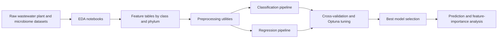

# Architecture

This repository is organized as a reusable `src`-layout Python package plus the original research notebooks and data snapshots.

## Package layout

- `wastewater_ml.config`: model names, registry metadata, and shared messages.
- `wastewater_ml.preprocessing`: encoding, scaling, SMOTE balancing, dimensionality reduction, outlier checks, and feature-importance helpers.
- `wastewater_ml.models`: model factory functions and Optuna objective functions for supported classifiers/regressors.
- `wastewater_ml.tuning`: Optuna study wrapper and model-retuning helper.
- `wastewater_ml.evaluation`: predictor validation, sparse matrix handling, K-fold scoring, and best-model summaries.
- `wastewater_ml.pipelines`: high-level classification and regression workflows.

## Design intent

The project started as exploratory wastewater-treatment research notebooks. The cleaned package separates the reusable ML infrastructure from notebook experimentation so the project can be reviewed, installed, and extended like a normal machine-learning codebase.
